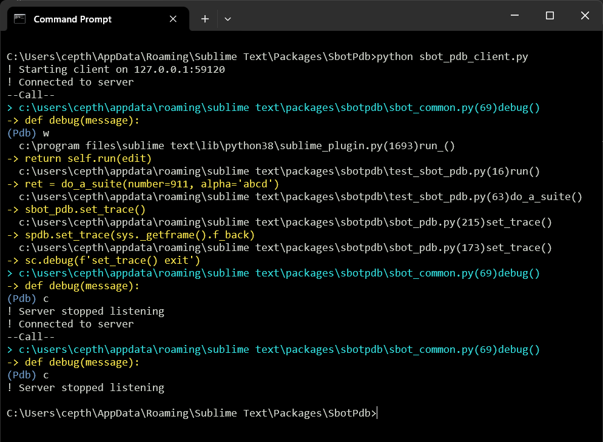

# Plugin Pdb

Sublime Text plugin for debugging ST plugins using pdb remotely over a tcp
connection. There are other remote pdb projects but this specifically targets
plugin debugging.

There's a fair amount hacked from [remote-db](https://github.com/ionelmc/python-remote-pdb)
with the addition of ST plugin hooks.

Built for ST4 on Windows. Linux should work but is untested.

## Features

- Uses generic tcp client - linux terminal, windows putty, etc. Or better yet, use the [Fancy Client](#fancy-client).
- Option for colorizing of output. Totally unnecessary but cute.
- Optional timeout can be set to force socket closure which unfreezes the ST application rather
  than having to forcibly shut it down.
- Work flow is to set a hard breakpoint using `sbot_pdb.breakpoint()`, run the plugin,
  and then connect to it with your client. You can then execute pdb commands.


## Usage

Typical usage is demonstrated with [example](https://github.com/cepthomas/SbotPdb/blob/main/example.py).
It's usually handy to add a command like this in one of your menus:
```json
{ "caption": "Run pdb example", "command": "sbot_pdb_example" },
```

To use in your plugin the easiest thing is:
- Copy `sbot_pdb.py` into your plugin directory.
- Add this at the place you want to break:

  `from . import sbot_pdb; sbot_pdb.breakpoint()`
- Run your client.
- Run your plugin.

## Fancy Client

Optionally you can use the smarter `sbot_pdb_client.py` script which does all of the above plus:
- Reads the same settings file as `Plugin Pdb` so no fiddling with hosts.
- Automatically connects to the server. This means that you can edit/run your plugin code
  without having to restart the client.
- Detects unresponsive server by requiring a response for each command sent.
- Provides some extra system status information, indicated by `!` (or marker of your choosing).
- Workflow is similar to the above except you can now reload/run the plugin code as part of your dev/edit cycle.
- Use ctrl-C to exit the client. The plugin will also stop/unblock.



## Settings

| Setting              | Description                              | Options              |
| :--------            | :-------                                 | :------              |
| host                 | TCP host - usually localhost             | default="127.0.0.1"  |
| port                 | TCP port in the range 49152 to 65535     | default=59120        |
| timeout              | Client connect after breakpoint() called | seconds 0=forever    |
| use_color            | Server provides ansi color - below       | true OR false        |
| internal_message_ind | Indicate internal message (not pdb)      | default="!"          |
| current_line_color   | Ansi color code                          | default=93 (yellow)  |
| exception_line_color | Ansi color code                          | default=92 (green)   |
| stack_location_color | Ansi color code                          | default=96 (cyan)    |
| prompt_color         | Ansi color code                          | default=94 (blue)    |
| error_color          | Ansi color code                          | default=91 (red)     |

Ansi codes from https://en.wikipedia.org/wiki/ANSI_escape_code#/media/File:ANSI_sample_program_output.png.


## Notes

- Because of the nature of remote debugging, issuing a `q(uit)` command instead of `c(ont)` causes
an unhandled `BdbQuit` [exception](https://stackoverflow.com/a/34936583).
Similarly, unhandled `ConnectionError` can occur. They are harmless but if it annoys you,
add (or edit) this code somewhere in your plugins:
```python
import bdb
def excepthook(type, value, tb):
    if issubclass(type, bdb.BdbQuit) or issubclass(type, ConnectionError):
        return  # ignore
    sys.__excepthook__(type, value, traceback)

# Connect the last chance hook.
sys.excepthook = excepthook
```

- Note that sublime is blocked while running the debugger so you can't edit files in that state.

- `sbot_common.py` contains miscellaneous common components primarily for internal use by the sbot family.
  This includes a very simple logger primarily for user-facing information, syntax errors and the like.
  Log file is in $APPDATA\Sublime Text\Packages\User\.SbotStore\sbot.log.
